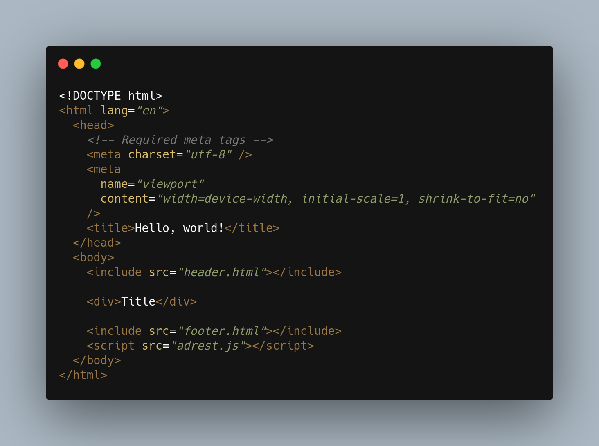

# Adrest.js

<a
    style="
    color: white;
    text-decoration: none;
    background-color: #212121; padding: 5px;
    "
    href="https://fauzan121002.github.io/adrest-js"
    target="_blank"
    >Adrest.js Documentation</a>

## Usage

### Extending layout

You must only extend one file inside the file.

### Include view

You can also include when extend.

